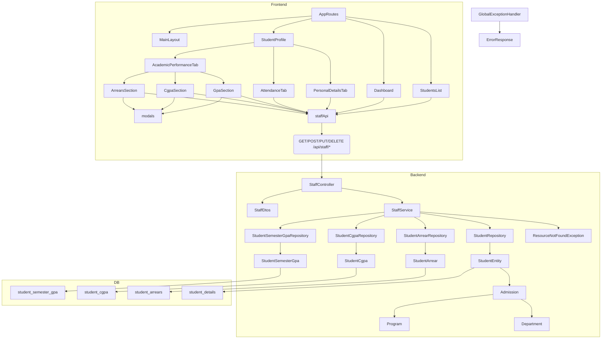

# ERP Staff Module — Technical Documentation

> **Project root:** `C:\Users\MOHANKUMAR\Documents\erp_staff`
> **Purpose:** Reference documentation for the existing **Staff Portal / Staff module** of the RGCET Academic ERP (post-admission) system.
> **Status of this document:** Compiled from direct source-code inspection. Nothing in this document is inferred — every statement is traceable to the actual implementation. Features found to be absent are explicitly marked `Not found in current implementation.`
> **Note:** This is a documentation-only artifact. No application source code was modified.

---

## 1. Staff Module Overview

### 1.1 What the Staff module does

The Staff module is a **read/manage layer over admitted-student academic data**. It does **not** manage staff members themselves (there is **no Staff entity, table, or repository**). Instead, every "staff" feature reads or writes data owned by the `Student`, `StudentSemesterGpa`, `StudentCgpa`, and `StudentArrear` entities.

The entire staff implementation lives in two places:

| Layer | Location |
| --- | --- |
| Backend API | `com.rgcet.admission.controller.StaffController` → `com.rgcet.admission.service.StaffService` |
| Frontend UI | React/Vite app (`src/`), all API traffic through `src/api/staffApi.ts` |

### 1.2 Purpose of the Staff Portal

The frontend `index.html` title is `Staff Portal | RGCET Academic ERP`. The Portal gives staff-facing users:

- A **dashboard** of academic activity (total/active students, active arrears, recent GPA/CGPA/Arrear updates).
- A **searchable student list** with department/year/section/status filters.
- A **student profile** with three tabs: Personal Details (read-only), Attendance (read-only), Academic Performance (editable — GPA/CGPA/Arrears CRUD).

### 1.3 Current implemented features

**Backend (`/api/staff`):**
- List + filter students (`search`, `department`, `year`, `section`, `status`).
- Single-student summary.
- Personal details (with Aadhaar masking).
- Academic summary (latest GPA, latest CGPA, active/cleared arrear counts).
- Dashboard summary (totals + recent updates feed).
- Full CRUD for Semester GPA, Year-wise CGPA, and Arrears.

**Frontend:**
- `Dashboard` page with stat cards and "Recent Academic Updates" feed.
- `StudentsList` page with search box, filter popover (department/year/section/status), client-side pagination, click-through to profile.
- `StudentProfile` page with 3 tabs (`/personal`, `/attendance`, `/academic`).
- Academic tab with GPA / CGPA / Arrears sub-tabs and add/edit/delete modals.
- Dark/light theming (default dark), persisted via `localStorage['rgcet_theme_mode']`.

### 1.4 Current workflow

```
Staff opens portal (no login)
  → GET / (redirects to /dashboard)
  → Dashboard shows stats + recent updates
  → Sidebar → Students → StudentsList (GET /api/staff/students)
  → Click a row → StudentProfile (GET /api/staff/students/{id})
      ├─ Personal tab   → GET /api/staff/students/{id}/personal   (read-only)
      ├─ Attendance tab → locally generated mock data             (read-only, fake)
      └─ Academic tab   → GET /api/staff/students/{id}/academic-summary
                          + GET/POST/PUT/DELETE for gpa, cgpa, arrears
```

### 1.5 Staff roles / personas

`Not found in current implementation.`
- There is **no role model**. The frontend has a static "Staff Profile / Staff" placeholder chip in `Header.tsx` (Avatar `SP`) that reads no user data.
- `PermissionBadge` (`viewonly` / `synced` / `editable`) is a purely **presentational** chip — no runtime role checks.
- `Sidebar` has no role-based items — two static links (`DASHBOARD`, `STUDENTS`).
- Backend has **no authentication/authorization at all** (see §6).

### 1.6 How the Staff module connects with other ERP modules

| ERP module | Connection | Evidence |
| --- | --- | --- |
| Student (admission) | Staff reads/writes students and their academic records | `StaffService.java` injects `StudentRepository`, `StudentSemesterGpaRepository`, `StudentCgpaRepository`, `StudentArrearRepository` |
| Admission data | Staff derives batch, program, department, admission date from `Student.getAdmission()` | `StaffService.getPersonalDetails` (line ~73); `deptName`, `deptShort`, `deriveYear` helpers |
| Department / Program (master data) | Read-only, via `Admission.getDepartment()/getProgram()` | `StaffService.deptName` (line ~397) |
| Attendance module | **No real connection.** Attendance is generated pseudo-randomly in the frontend (`staffApi.generateAttendance`) and is read-only | `src/api/staffApi.ts:62-77,125-130` |
| Auth / User | **None.** No linkage to `AdminProfile` or any user system | entire codebase search |

### 1.7 Feature completeness summary

| Feature | Status |
| --- | --- |
| Student list + filters | Fully implemented (backend + frontend) |
| Student profile (personal) | Fully implemented, read-only |
| GPA CRUD | Fully implemented (backend + frontend) |
| CGPA CRUD | Fully implemented (backend + frontend) |
| Arrears CRUD | Fully implemented (backend + frontend) |
| Dashboard (stats + recent updates) | Fully implemented |
| Attendance | **Partial / frontend-only + fake data** (no backend, mocked locally) |
| Staff authentication / login | Not implemented |
| Role-based restrictions | Not implemented (`PermissionBadge` is cosmetic) |
| Section management | Not implemented — section is **computed** (`studentId % 2 == 0 ? "A" : "B"`) |
| Class/section associations, subject allocation, HOD features | Not found in current implementation |

---

## 2. Project Structure

### 2.1 Top-level layout

```
erp_staff/
├── backend/                 # Spring Boot 3.4.1 (Java 17) — admission + staff API
├── src/                     # React 19 + Vite 6 frontend (the "Staff Portal" app)
├── public/images/           # Static images (college logo, theme backgrounds)
├── package.json             # Frontend deps + scripts (dev = vite)
├── vite.config.ts           # Dev server port 3000, open-in-browser
├── .env                     # VITE_API_BASE_URL=http://localhost:8080
├── index.html               # "Staff Portal | RGCET Academic ERP"
├── run.py                   # Dev launcher: starts backend (Maven) THEN frontend (Vite)
├── run_project.py           # Alternate launcher script
├── setup.bat / setup.sh     # One-time setup scripts
└── *.md                      # Docs: Database_Schema_Combined_Updated.md, Frontend_Folder_Structure.md, frontend_workflow.md, etc.
```

### 2.2 Frontend (src/)

| Path | Purpose / contents |
| --- | --- |
| `src/main.tsx` | React entry, mounts `App` |
| `src/App.tsx` | Provider stack: `BrowserRouter → ThemeProvider → AppProvider → AppRoutes` |
| `src/routes/AppRoutes.tsx` | Single nested route table (see §3.14) — **no guards** |
| `src/api/staffApi.ts` | The **only** HTTP client; all `/api/staff/*` calls + attendance mock |
| `src/api/mockData.ts` | Hard-coded demo data — **dead code, imported nowhere** |
| `src/context/AppContext.tsx` | Snackbar + ConfirmDialog state (no user/role state) |
| `src/context/ThemeContext.tsx` | Light/dark mode |
| `src/pages/Dashboard.tsx` | Landing page: stat cards + recent updates feed |
| `src/pages/students/StudentsList.tsx` | Filterable student table |
| `src/pages/students/StudentProfile.tsx` | Profile header + 3 tabs handler |
| `src/pages/students/tabs/PersonalDetailsTab.tsx` | Read-only personal info grid |
| `src/pages/students/tabs/AttendanceTab.tsx` | Read-only attendance (mock data) |
| `src/pages/students/tabs/AcademicPerformanceTab.tsx` | Summary + GPA/CGPA/Arrears sub-tabs |
| `src/components/academic/GpaSection.tsx` | GPA table + add/edit modal wiring |
| `src/components/academic/CgpaSection.tsx` | CGPA table + add/edit modal wiring |
| `src/components/academic/ArrearsSection.tsx` | Arrears table + add/edit/delete wiring |
| `src/components/academic/modals.tsx` | `GpaModal`, `CgpaModal`, `ArrearModal` + validation |
| `src/components/common/*` | `ConfirmDialog`, `EmptyState`, `ErrorState`, `PageHeader`, `PageSkeleton`, `PermissionBadge`, `Snackbar`, `StatusChip` |
| `src/components/layout/*` | `Breadcrumb`, `Footer`, `Header`, `MainLayout`, `Sidebar` |
| `src/components/ui/*` | `AppCard`, `SummaryCard` (`SummaryCard` is unused) |
| `src/types/index.ts` | All shared TS types (see §3.15) |
| `src/utils/dateUtils.ts` | `calculateAgeFromDOB`, `formatDateDisplay` — **both unused** |
| `src/theme/*` | `colors.ts`, `lightTheme.ts`, `darkTheme.ts`, `index.ts` |

### 2.3 Backend (backend/src/main/java/com/rgcet/admission/)

#### Controllers (`controller/`)
| File | Base path | Role |
| --- | --- | --- |
| `StaffController.java` | `/api/staff` | **Staff module endpoints** |
| `StudentController.java` | `/api/students` | Admission-wizard student management (used indirectly — the Student list the Staff module reads is the same data) |
| `MasterDataController.java` | `/api` | Read-only master data (programs/departments/categories/certificates/hostels/bus routes/fee structures/scholarship structures) |
| `AdminProfileController.java` | `/api/profile` | Admin profile read/update (plaintext-password auth-lite) |
| `BulkAdmissionController.java` | `/api/bulk-admission` | Spreadsheet bulk admission |
| `BulkUpdateController.java` | `/api/bulk-update` | Spreadsheet bulk update |
| `CertificateController.java` | `/api/certificates` | Certificate file upload/delete |

#### Services (`service/`)
| File | Role |
| --- | --- |
| `StaffService.java` | **Staff module business logic** (§4) |
| `StudentService.java` | Admission wizard, student lifecycle, archiving |
| `MasterDataService.java` | Master-data reads |
| `AdminProfileService.java` | Profile + plaintext password change |
| `BulkAdmissionService.java` / `BulkUpdateService.java` / `BulkAdmissionSchemaService.java` / `BulkUpdateSchemaService.java` | Bulk import/update |
| `CertificateService.java` + `FileStorageService.java` | Certificate storage |
| `FeeService.java`, `CutoffCalculator.java`, `FeeResult.java` | Fee calculation (used at admission time) |

#### DTOs (`dto/`)
- `StaffDtos.java` — all staff DTOs as nested Java records (§4.2).
- Others (`PersonalStepRequest`, `AcademicStepRequest`, `StudentResponseDto`, etc.) belong to the admission module.

#### Entities (`entity/`) — see §5 for the full inventory.

#### Repositories (`repository/`)
- `StudentRepository`, `StudentSemesterGpaRepository`, `StudentCgpaRepository`, `StudentArrearRepository` → used by `StaffService`.
- Remaining repositories serve the admission module (see §5).

#### Config (`config/`)
- `CorsConfig.java` — CORS for `/api/**`.
- `WebConfig.java` — static serving of `/uploads/**`.
- `DataSeeder.java` — seeds master data + 10 demo students when `app.maintenance.enabled=true`.
- `LegacyEnumMigrationRunner.java` — migrates legacy enum strings (Gender/Caste).

#### Common (`common/`)
- `GlobalExceptionHandler.java`, `ErrorResponse.java`, `ResourceNotFoundException.java`, `TextUtil.java`.

### 2.4 Backend resources
- `backend/src/main/resources/application.yml` (+ `application.properties`) — see §13.
- `backend/src/main/resources/db/uppercase_existing.sql` — one-time idempotent UPPER() normalization across 16 tables.
- `backend/src/main/resources/db/vocational_subject_normalization.sql` — normalizes `hsc_vocational_marks` to a canonical 5-row structure.

---

## 3. Frontend Details

### 3.1 Provider stack (`src/App.tsx`)
```tsx
<BrowserRouter>
  <ThemeProvider>      {/* MUI theme + CssBaseline; default dark; persisted */}
    <AppProvider>      {/* snackbar + confirm-dialog state only */}
      <AppRoutes />
    </AppProvider>
  </ThemeProvider>
</BrowserRouter>
```

### 3.2 `src/context/AppContext.tsx`
- Exposes `useApp()` → `{ showSnackbar, showConfirm, hideConfirm }`.
- `showConfirm` merges defaults (`confirmText: 'Confirm'`, `cancelText: 'Cancel'`, `confirmColor: 'error'`).
- **No user / role / auth state exists in this context.**

### 3.3 `src/context/ThemeContext.tsx`
- Exposes `{ mode: 'light' | 'dark'; toggleTheme: () => void }`.
- Initial mode from `localStorage['rgcet_theme_mode']`, **default dark**.
- Wraps children in MUI `ThemeProvider` theme = `lightTheme | darkTheme` + `<CssBaseline />`.

### 3.4 `src/routes/AppRoutes.tsx` — exact route table

| Route path | Element | Notes |
| --- | --- | --- |
| `/` | `<Navigate to="/dashboard" replace />` | Root redirect |
| `/dashboard` | `<Dashboard />` | Landing |
| `/students` | `<StudentsList />` | Student list |
| `/students/:studentId` | `<StudentProfile />` | Profile; tab derived from pathname (defaults to Personal) |
| `/students/:studentId/personal` | `<StudentProfile />` | Personal tab |
| `/students/:studentId/attendance` | `<StudentProfile />` | Attendance tab |
| `/students/:studentId/academic` | `<StudentProfile />` | Academic tab |
| `*` | `<Navigate to="/dashboard" replace />` | Fallback |

All routes are wrapped in `<MainLayout>` (header + sidebar + footer). **There are no route guards, no auth wrappers, no lazy loading.**

### 3.5 `Dashboard.tsx`
- **Purpose:** Landing page — "Welcome back — here is an overview of student academics."
- **API:** `staffApi.getDashboardSummary()` once on mount → `DashboardSummary`.
- **Loading:** `<PageSkeleton variant="dashboard" />`.
- **Error:** `<ErrorState ... onRetry={load} />`.
- **Sections:**
  - Stat cards: **Total Students** (clickable → `/students`), **Active Arrears** (not clickable).
  - **Recent Academic Updates** feed inside `AppCard` — rows show avatar icon by type (`GPA` → GraduationCap/`#0284C7`, `CGPA` → Award/`#7C3AED`, `Arrear` → BookX/`#DC2626`), student name, regNo, description, relative time via local `timeAgo()`. Click row → `/students/{studentId}`. Empty state: "No recent academic activity."
- Uses `useThemeContext` for dark/light colors.

### 3.6 `StudentsList.tsx`
- **Purpose:** "View all admitted students and access their academic records."
- **API:** `staffApi.getStudents()` once on mount — **filters applied, no params passed** (filters are client-side even though the API supports server-side params).
- **State:** `loading`, `error`, `allStudents: StudentSummary[]`; client filters `search/department/year/section/status` (default `'ALL'`); `page` (0‑indexed); `filterAnchor` (popover).
- **Filters:**
  - Search box: placeholder "Search by register no or student name...", matches `name` or `regNo` (lowercase includes).
  - Filter popover (width 300): Department select (`deptOptions` from data via `useMemo`), Year select (All/1/2/3), Section select (All/A/B), Status select (All/ACTIVE/ARCHIVED), "Clear All Filters" button.
  - Filter change resets `page` to 0.
- **Table columns:** `Register No`, `Student Name`, `Department` (shows `deptShort`), `Year / Section`, `Status` (chip), `Action` (Eye icon button → `/students/{studentId}`).
- **Pagination:** client-side, `ROWS_PER_PAGE = 10`; footer "Showing X - Y of N students", page pill, Previous/Next.
- **States:** table skeleton (`PageSkeleton variant="table"`), `ErrorState` ("Unable to load students"), `EmptyState` ("No students found").
- **Note:** Strictly all students are fetched and filtered in the browser; the `StudentFilters` param object exists in `staffApi.ts` but is never passed by this page.

### 3.7 `StudentProfile.tsx`
- **Route param:** `useParams<{ studentId: string }>()` → `Number(studentId)`; active tab derived from `useLocation().pathname`:
  ```ts
  const tabValue = pathname.endsWith('/attendance') ? 1
    : pathname.endsWith('/academic') ? 2 : 0;
  ```
- **API:** `staffApi.getStudentSummary(id)`; `null` → throws "Student not found"; reloads on `[id]`.
- **States:** inline skeletons; `ErrorState` ("Student not found") with retry.
- **Header card:** "Back to Students" button, initials Avatar, name + Status chip, `regNo · deptShort`, `Year {year} · Section {section} · {department}`.
- **Tabs:** Personal Details (`User`), Attendance (`CalendarCheck`), Academic Performance (`BookOpen`). `handleTabChange` navigates to `${base}/personal|attendance|academic`.
- Renders child tab components conditionally.

### 3.8 `tabs/PersonalDetailsTab.tsx`
- **Props:** `{ studentId: number }`.
- **API:** `staffApi.getPersonalDetails(studentId)`.
- **UI:** read-only grid of 14 fields (`PermissionBadge variant="viewonly"`): Full Name / Register No / Application No / Date of Birth / Gender / E-mail ID / Mobile Number / District / Caste / Aadhaar No / Batch / Program / Department / Date of Admission.
- **Formatting:** DOB & admission date `YYYY-MM-DD → DD-MM-YYYY`; mobile `1111-222-3333`; missing → `-`.
- **States:** skeleton rows; `ErrorState` ("Unable to load personal details").
- No forms, no dialogs — **view only**.

### 3.9 `tabs/AttendanceTab.tsx`
- **Props:** `{ studentId: number }`.
- **API:** `staffApi.getAttendance(studentId)` — **this is the mocked function**, not a backend call. Throws for student id 30 ("Attendance service is temporarily unavailable for this student.").
- **UI:** overall-attendance ring (color: ≥85 → green `#16A34A`, ≥75 → amber `#F59E0B`, else red `#DC2626`), subtitle "Combined across N semester(s)... synced from the attendance module and is read-only." — a materially **false** statement, since the data is locally generated fake data.
- **Table "Semester-wise Attendance":** Semester / Present / Total Classes / Attendance % / Progress bar.
- **Refresh UI:** "Sync Attendance Data" → `load(true)` re-fetches same fake data + snackbar.
- **States:** table skeleton; `ErrorState` ("Unable to load attendance").

### 3.10 `tabs/AcademicPerformanceTab.tsx`
- **Props:** `{ studentId: number }`.
- **API:** `staffApi.getAcademicSummary(studentId)`.
- **UI:** summary `AppCard` ("Academic Performance" + `PermissionBadge variant="editable"`) with 4 stat cells — Latest GPA (`#0284C7`), Latest CGPA (`#7C3AED`), Active Arrears (`#DC2626`), Cleared Arrears (`#16A34A`).
- **Sub-tabs** via URL search param: `?tab=gpa|cgpa|arrears` (default `gpa`).
- Renders `<GpaSection>`, `<CgpaSection>`, or `<ArrearsSection>`, passing `onChanged={refreshSummary}`.

### 3.11 Academic components
All three sections share the pattern: props `{ studentId; onChanged }`, own `loading/error/records` state + modal state, reload on `[studentId]`, snackbar on success, `ErrorState` on failure.

**`GpaSection.tsx`** — "Semester-wise GPA" table (`Semester/ Academic Year / Semester GPA / Action(edit)`). "Add GPA" button; `EmptyState` "No GPA records yet". Calls `getGpa`, `addGpa`, `updateGpa`.

**`CgpaSection.tsx`** — "Year-wise CGPA" table (`Year / Academic Year / CGPA / Action`). "Add CGPA"; `EmptyState` "No CGPA records yet". Calls `getCgpa`, `addCgpa`, `updateCgpa`.

**`ArrearsSection.tsx`** — "Arrears" with "Add Arrear"; two summary boxes (Active = ACTIVE status, amber; Cleared = CLEARED, green). Table: `Semester / Subject / Attempt / Status (StatusChip) / Remarks / Actions`. **Delete** uses global `ConfirmDialog` → `deleteArrear`. Calls `getArrears`, `addArrear`, `updateArrear`.

**`modals.tsx`** — shared `ModalProps`, `semesterOptions=[1..8]`, `titleCase`, `validateGpaValue` (required, numeric, 0–10, ≤2 decimals).
- `GpaModal` — fields: Semester select (existing-semester disabled; in edit mode disabled), Academic Year text, GPA number input (`step 0.01`, min 0, max 10). Submit rounds to 2 decimals.
- `CgpaModal` — same pattern with `existingYears`.
- `ArrearModal` — fields: Semester select, Subject Name (title-cased on submit), Exam Attempt (min 1), Status select (ACTIVE/CLEARED), Remarks (multiline). Validation: semester required, subject required, attempt ≥ 1.

### 3.12 Layout & shell components
| Component | Behavior |
| --- | --- |
| `Header` | Sticky 64px; mobile menu; college logo (`/images/college-logo.png`) → `/dashboard`; title "STAFF PORTAL / Academic ERP System"; theme toggle; **static** "Staff Profile / Staff" chip (Avatar `SP`) — no user data. |
| `Sidebar` | 240px; gradient blue (light) / `#0F172A` (dark); **static** items: DASHBOARD (`/dashboard`), STUDENTS (`/students`); bottom shows "Academic ERP Systems · Version 2.4.0". No role logic. |
| `MainLayout` | Header + desktop sidebar / mobile Drawer + `<Breadcrumb>` + animated route content + `<Footer>`; mounts global `AppSnackbar` and `ConfirmDialog`. |
| `Breadcrumb` | Reads `location.pathname`: `/dashboard` → [Dashboard]; `/students` paths → [Dashboard, Students, Student Profile]; first crumb "ERP Portal" → `/dashboard`. |
| `Footer` | Policy links (`href="#"` placeholders) + © 2024 RGCET. |
| `PermissionBadge` | Static chip: `viewonly` → "VIEW ONLY", `synced` → "SYNCED DATA", `editable` → "STAFF EDITABLE". **Cosmetic only.** |
| `StatusChip` | ACTIVE → amber, CLEARED → green. |
| Common UI | `EmptyState`, `ErrorState` (Retry button), `PageHeader`, `PageSkeleton` (variants list/table/profile/dashboard), `AppCard`, `Snackbar`. |

### 3.13 API client `src/api/staffApi.ts`
- `API_BASE = import.meta.env.VITE_API_BASE_URL ?? 'http://localhost:8080'`.
- Shared `request<T>`: fetch with JSON headers; network failure → `Error('Unable to reach the server. ...')`; non-OK → `HttpError(message from body.message, status)`; `204` → `undefined`.
- Endpoints used (full list in §4 table).

### 3.14 Navigation flow
```
"/" → /dashboard
/dashboard (Total Students card) → /students
/dashboard (recent update row)   → /students/{studentId}
/students (row eye icon)         → /students/{studentId}  (default = personal tab)
/students/{id} tab clicks        → /students/{id}/personal | /attendance | /academic
```

### 3.15 Types (`src/types/index.ts` — exact)
`StudentSummary`, `PersonalDetails`, `ArrearStatus`, `SemesterGpa`, `YearCgpa`, `Arrear`, `AttendanceRecord`, `AttendanceData`, `AcademicSummary`, `RecentUpdate`, `DashboardSummary` — matching the backend records field-for-field (JS `number` ↔ `BigDecimal`, `string` date ↔ `LocalDate/LocalDateTime`).

There are **no user/staff/auth/role types** in `types/index.ts`.

---

## 4. Backend API Documentation

### 4.1 Staff endpoints (`StaffController`, base `/api/staff`)

| Method | Endpoint | Controller method | Request params / body | DTO | Response | Auth/Role |
| --- | --- | --- | --- | --- | --- | --- |
| GET | `/api/staff/students` | `listStudents` | `search?`, `department?`, `year?`, `section?`, `status?` | — | `List<StaffStudentSummary>` | None |
| GET | `/api/staff/students/{id}` | `getStudent` | path `id: Long` | — | `StaffStudentSummary` | None |
| GET | `/api/staff/students/{id}/personal` | `getPersonal` | path `id` | — | `StaffPersonalDetails` | None |
| GET | `/api/staff/students/{id}/gpa` | `getGpa` | path `id` | — | `List<StaffGpaRecord>` | None |
| POST | `/api/staff/students/{id}/gpa` | `addGpa` (`@Valid`) | path `id`; body `StaffGpaRequest` | `StaffGpaRequest` | `201` + `StaffGpaRecord` | None |
| PUT | `/api/staff/gpa/{gpaId}` | `updateGpa` (`@Valid`) | path `gpaId`; body `StaffGpaRequest` | `StaffGpaRequest` | `StaffGpaRecord` | None |
| GET | `/api/staff/students/{id}/cgpa` | `getCgpa` | path `id` | — | `List<StaffCgpaRecord>` | None |
| POST | `/api/staff/students/{id}/cgpa` | `addCgpa` (`@Valid`) | path `id`; body `StaffCgpaRequest` | `StaffCgpaRequest` | `201` + `StaffCgpaRecord` | None |
| PUT | `/api/staff/cgpa/{cgpaId}` | `updateCgpa` (`@Valid`) | path `cgpaId`; body `StaffCgpaRequest` | `StaffCgpaRequest` | `StaffCgpaRecord` | None |
| GET | `/api/staff/students/{id}/arrears` | `getArrears` | path `id` | — | `List<StaffArrearRecord>` | None |
| POST | `/api/staff/students/{id}/arrears` | `addArrear` (no `@Valid`) | path `id`; body `StaffArrearRequest` | `StaffArrearRequest` | `201` + `StaffArrearRecord` | None |
| PUT | `/api/staff/arrears/{arrearId}` | `updateArrear` (no `@Valid`) | path `arrearId`; body `StaffArrearRequest` | `StaffArrearRequest` | `StaffArrearRecord` | None |
| DELETE | `/api/staff/arrears/{arrearId}` | `deleteArrear` | path `arrearId` | — | `204 No Content` | None |
| GET | `/api/staff/students/{id}/academic-summary` | `getAcademicSummary` | path `id` | — | `StaffAcademicSummary` | None |
| GET | `/api/staff/dashboard/summary` | `getDashboard` | — | — | `StaffDashboardSummary` | None |

**Key contract facts:**
- **No authentication or authorization on any endpoint.** All are public.
- Arrear POST/PUT are **not** annotated `@Valid` (unlike GPA/CGPA) — bean validation is not enforced for arrears.
- `StaffGpaRequest`: `@NotNull @Positive Integer semesterNumber`, `@NotBlank String academicYear`, `@NotNull BigDecimal semesterGpa`.
- `StaffCgpaRequest`: `@NotNull @Positive Integer yearNumber`, `@NotBlank String academicYear`, `@NotNull BigDecimal cgpa`.
- `StaffArrearRequest`: `@Positive Integer semesterNumber`, `String subjectName`, `@Positive Integer examAttempt`, `ArrearStatus arrearStatus`, `String remarks` — all fields optional.

### 4.2 DTO shapes (`StaffDtos.java` — Java records)

| Record | Fields |
| --- | --- |
| `StaffStudentSummary` | `Long studentId, String regNo, String name, String department, String deptShort, Integer year, String section, String status` |
| `StaffPersonalDetails` | `Long studentId, String regNo, String applicationNo, String name, String dob, String gender, String email, String mobile, String district, String caste, String aadhaar, String batch, String program, String department, String admissionDate` |
| `StaffGpaRecord` | `Long gpaId, Long studentId, Integer semesterNumber, String academicYear, BigDecimal semesterGpa` |
| `StaffCgpaRecord` | `Long cgpaId, Long studentId, Integer yearNumber, String academicYear, BigDecimal cgpa` |
| `StaffArrearRecord` | `Long arrearId, Long studentId, Integer semesterNumber, String subjectName, Integer examAttempt, ArrearStatus arrearStatus, String remarks` |
| `StaffAcademicSummary` | `BigDecimal latestGpa, BigDecimal latestCgpa, long activeArrears, long clearedArrears` |
| `StaffRecentUpdate` | `Long id, String regNo, Long studentId, String studentName, String type, String description, LocalDateTime updatedAt` |
| `StaffDashboardSummary` | `long totalStudents, long activeStudents, long activeArrears, List<StaffRecentUpdate> recentUpdates` |

### 4.3 `StaffService` method → data operations

| Service method | DB operations |
| --- | --- |
| `listStudents(...)` | `studentRepository.findAll()` + `gpaRepository.findAll()` (grouped in memory), then in-memory filter + sort by regNo |
| `getStudent(id)` | `findById` (404 via `ResourceNotFoundException`) + `findByStudentStudentIdOrderBySemesterNumberAsc` |
| `getPersonalDetails(id)` | `findById`; reads through `Student.getAdmission()` (batch/program/dept/admission date); masks Aadhaar |
| `getGpa / addGpa / updateGpa` | `findByStudentStudentIdOrderBySemesterNumberAsc`; **duplicate-semester guard** `assertGpaSemesterFree`; save |
| `getCgpa / addCgpa / updateCgpa` | `findByStudentStudentIdOrderByYearNumberAsc`; **duplicate-year guard** `assertCgpaYearFree`; save |
| `getArrears / addArrear / updateArrear / deleteArrear` | `findByStudentStudentIdOrderBySemesterNumberAsc`; `applyArrear` partial-update logic; sets `clearedDate=now` on CLEARED, `attemptDate=now` on create; save/delete |
| `getAcademicSummary(id)` | reads the three tables, latest GPA/CGPA by list order, filters arrears by status |
| `getDashboard()` | counts students (`status != ARCHIVED` = active), counts ACTIVE arrears across all, aggregates recent updates from GPA+CGPA+Arrear (each `findAllByOrderByCreatedAtDesc...`), top 6, sorted by `updatedAt` desc then id desc |

### 4.4 Derived-data logic (important — data is NOT stored)
- **Year** (`deriveYear`, `StaffService:374`): `(maxSemester + 1) / 2` from GPA records; else from batch year (`currentYear - startYear + 1`); else `1`.
- **Section** (`deriveSection`, `StaffService:393`): `studentId % 2 == 0 ? "A" : "B"` — **placeholder logic, not real data**.
- **Reg no** (`regNoOf`): `registerNo` if present, else `applicationNo`.
- **Dept short** (`deptShort`): extracts parenthesized acronym from department name, else hard-coded prefixes (`M.TECH COMPUTER→"MTech CSE"`, `M.TECH WIRELESS→"MTech WC"`, `MASTER OF BUSINESS→"MBA"`, `MASTER OF COMPUTER→"MCA"`).
- **Gender display**: stored STRING enum; title-cased (`MALE→Male`) in personal details.

---

## 5. Database Documentation

Database: **PostgreSQL** (default database name `erp_admission` via env override; actual `.env` uses `erp_staff`). Schema managed by Hibernate **`ddl-auto: update`** (no Flyway/Liquibase; only ad-hoc `.sql` scripts under `resources/db/`).

All PKs are `Long` with `IDENTITY` generation. All `String` columns default to length 255. All enums stored as **`EnumType.STRING`**. Every to-many relation is `cascade=ALL`, `orphanRemoval=true`, `FetchType.LAZY`. All one-to-one owning sides join on `student_id`.

### 5.1 Tables directly used by the Staff module

**`student_details`** (entity `Student`)
| Column | Type | Notes |
| --- | --- | --- |
| `student_id` | Long | PK, IDENTITY |
| `application_no` | String | NOT NULL, **unique** |
| `register_no` | String | — |
| `student_name` | String | NOT NULL |
| `date_of_birth` | LocalDate | — |
| `age` | Integer | — |
| `aadhaar_no` | String | — |
| `mobile_number` | String | — |
| `email_id` | String | — |
| `gender` | `Gender` enum | `MALE, FEMALE, OTHERS` |
| `district` | String | — |
| `nationality` | String | — |
| `caste` | `Caste` enum | `OBC, SC, ST, OTHERS` |
| `status` | `StudentStatus` enum | `DRAFT, ACTIVE, ARCHIVED`; NOT NULL; default `DRAFT` |
| `created_at` / `updated_at` / `archived_at` | LocalDateTime | — |
| `archive_reason` | String | — |

Relations (inverse side, LAZY):
- `@OneToOne` → `ParentDetails` (mappedBy `student`), `Admission`, `QualifyingExam`, `DiplomaDetails`, `PGQualification`, `StudentFee`
- `@OneToMany` → `List<Address>`, `List<StudentCertificate>`
- `@PrePersist/@PreUpdate` uppercase text fields.

**`admission`** (entity `Admission`)
| Column | Type | Notes |
| --- | --- | --- |
| `admission_id` | Long | PK |
| `student_id` | Long | FK → `student_details(student_id)` (`@OneToOne`) |
| `batch` | String | e.g. `2026-27`; uppercased |
| `date_of_admission` | LocalDate | — |
| `category_id` | Long | FK → `admission_category` (`@ManyToOne` LAZY) |
| `program_id` | Long | FK → `program` (`@ManyToOne` LAZY) |
| `department_id` | Long | FK → `department` (`@ManyToOne` LAZY) |

**`student_semester_gpa`** (entity `StudentSemesterGpa`)
| Column | Type | Notes |
| --- | --- | --- |
| `gpa_id` | Long | PK |
| `student_id` | Long | FK → `student_details(student_id)`, **NOT NULL** (`@ManyToOne` LAZY) |
| `semester_number` | Integer | NOT NULL |
| `academic_year` | String | NOT NULL |
| `semester_gpa` | BigDecimal | NOT NULL |
| `created_at` / `updated_at` | LocalDateTime | timestamps |

**`student_cgpa`** (entity `StudentCgpa`)
| Column | Type | Notes |
| --- | --- | --- |
| `cgpa_id` | Long | PK |
| `student_id` | Long | FK → `student_details`, NOT NULL |
| `year_number` | Integer | NOT NULL |
| `academic_year` | String | NOT NULL |
| `cgpa` | BigDecimal | NOT NULL |
| `created_at` / `updated_at` | LocalDateTime | timestamps |

**`student_arrears`** (entity `StudentArrear`)
| Column | Type | Notes |
| --- | --- | --- |
| `arrear_id` | Long | PK |
| `student_id` | Long | FK → `student_details`, NOT NULL |
| `semester_number` | Integer | NOT NULL |
| `subject_name` | String | NOT NULL |
| `exam_attempt` | Integer | NOT NULL |
| `arrear_status` | `ArrearStatus` enum | `ACTIVE, CLEARED`; NOT NULL |
| `attempt_date` | LocalDate | set to now on create |
| `cleared_date` | LocalDate | set to now when marked CLEARED |
| `remarks` | String | — |
| `created_at` / `updated_at` | LocalDateTime | — |

### 5.2 Master-data tables referenced through `admission`

**`department`** — `department_id` PK; `department_name` NOT NULL **unique**. Seeded: CSE, AI&DS, IT, AI&ML, ECE, BME, M.Tech CSE, M.Tech Wireless Communication, MBA, MCA.
**`program`** — `program_id` PK; `program_name` NOT NULL **unique**; `duration_years` Integer.
**`admission_category`** — `category_id` PK; `category_name` NOT NULL **unique** (CENTAC, Management).
**`certificate`** — `certificate_id` PK; `certificate_name` NOT NULL **unique** (12 seeded).
**`hostel` / `bus_route` / `bus_stop`** — fee-related master data.
**`tuition_fee_structure` / `scholarship_structure`** — fee slabs (by program/department/category).

### 5.3 Other student-lifecycle tables (admission module, not staff-CRUD)

`parent_details` (Father name/mobile/occupation, annual income), `address` (PERMANENT/COMMUNICATION), `qualifying_examination`, `hsc_academic_marks`, `hsc_vocational_marks`, `diploma_details`, `pg_qualification`, `student_certificate`, `student_fee` (full fee breakdown), `archive` (archival reason), `audit_log` (plain audit trail, used by bulk modules). `admin_profile` (id, admin_name NOT NULL, username UNIQUE NOT NULL, password NOT NULL, role, updated_at) — **auth-lite, no login endpoint**.

### 5.4 Entity relationship inventory (from code)

- `@OneToOne` (owning, `@JoinColumn(name="student_id")`): `Admission→Student`, `ParentDetails→Student`, `QualifyingExam→Student`, `DiplomaDetails→Student`, `PGQualification→Student`, `StudentFee→Student`.
- `@ManyToOne`: `StudentSemesterGpa→Student`, `StudentCgpa→Student`, `StudentArrear→Student`, `Address→Student`, `Archive→Student`, `StudentCertificate→Student/_Certificate`, `Admission→{AdmissionCategory, Program, Department}`, `StudentFee→{TuitionFeeStructure, BusRoute, BusStop, Hostel}`, HSC marks → `QualifyingExam`.
- `@OneToMany` (mappedBy): `Student→{ParentDetails, Admission, QualifyingExam, DiplomaDetails, PGQualification, StudentFee, Address, StudentCertificate}`, `QualifyingExam→{HSCAcademicMark, HSCVocationalMark}`, `BusRoute→BusStop`.
- `@ManyToMany`: **none** in the entire project.
- **There is NO `staff`, `hod`, `section`, `class`, `subject_allocation`, or `attendance` table.**

### 5.5 Reasons to note
- `section` and `year` are not columns anywhere — they are computed on read (§4.4).
- A "Year 1..3" filter on the frontend maps to the computed `deriveYear`, so filter semantics depend on GPA/batch data quality.

---

## 6. Staff Authentication & Authorization

### Verdict: **NOT IMPLEMENTED.**

Evidence:
- **No login endpoint.** Search across the entire backend for `login`, `Jwt`, `token`, `Session`, `@PreAuthorize`, `@Secured`, `SecurityFilterChain`, `AuthenticationManager`, `BCrypt`, `PasswordEncoder` → **zero matches** in Java/files YAML/XML.
- **No Spring Security dependency.** `backend/pom.xml` contains only: web, data-jpa, validation, postgres, lombok, h2 (test), starter-test. `spring-boot-starter-security` is **absent**.
- **No security config class.** `config/` contains only `CorsConfig`, `WebConfig`, `DataSeeder`, `LegacyEnumMigrationRunner`.
- **Every REST endpoint is publicly reachable**, including all `/api/staff/**` mutations.
- The only credential-related artifacts (`AdminProfile` entity + `AdminProfileService`) are **not wired to any authentication**:
  - `AdminProfileRepository.findByUsername` is **declared but never invoked**.
  - `AdminProfileService.getOrCreateDefaultProfile()` creates a default profile (username `admin`, password `admin123`, role `Administrator`); password stored in **plaintext** and compared with `.equals(...)`.
  - `AdminProfileController` exposes `/api/profile` GET/PUT with `@CrossOrigin("*")` — profile read/update, **no token/session**.
- Frontend: **no login page, no logout, no auth guard, no token storage, no `Authorization` header**. `Header.tsx` "Staff Profile" chip is a static placeholder.

**How the system "knows" the current staff member:** It does not. There is no concept of a logged-in staff identity anywhere in the stack.

**Logout flow:** Not implemented.

**Password handling:** Only the placeholder admin profile stores a password (plaintext). No hashing anywhere.

---

## 7. Staff → Student Relationship

- **Staff association to department/class/section:** `Not found in current implementation.` There is no `staff` table, no `staff_department`, no `staff_class`, no `staff_section` mapping. Staff members are not modelled as data.
- **Assignment of staff to students:** `Not found in current implementation.`
- **Class coordinator functionality:** `Not found in current implementation.` (grep for `coordinator` / `hod` / `class` across `src/` and `backend/` → no matches.)
- **Subject allocation:** `Not found in current implementation.`
- **Student filtering logic that exists:** `StaffService.listStudents` filters by `search` (name/regNo), `department` (equalsIgnoreCase on department name), `year` (equals on derived year), `section` (equalsIgnoreCase on derived section), `status` (equalsIgnoreCase). **All filters are in-memory** on a full `findAll()` — there is no SQL-level filtering and no `JpaRepository` query for staff search.
- **How empty department is handled:** students whose admission/department is null get `department = ""` and are still returned.
- **Section derivation is fake** (`studentId % 2`), so "Section A/B" filtering is pseudo-random per student id.

---

## 8. Academic Features Matrix

| Feature | Status | Where |
| --- | --- | --- |
| Semester GPA entry/view | **Implemented (backend + frontend)** | `/api/staff/.../gpa`; `GpaSection` |
| Year-wise CGPA entry/view | **Implemented (backend + frontend)** | `/api/staff/.../cgpa`; `CgpaSection` |
| Arrears entry/view/clear | **Implemented (backend + frontend)** | `/api/staff/.../arrears`; `ArrearsSection` |
| Academic summary (latest GPA/CGPA, arrear counts) | **Implemented (backend + frontend)** | `/api/staff/.../academic-summary` |
| Dashboard / recent updates | **Implemented (backend + frontend)** | `/api/staff/dashboard/summary`; `Dashboard.tsx` |
| Attendance | **Partially implemented / frontend-only / FAKE** | `staffApi.getAttendance` generates pseudo-random data; read-only UI |
| Subject management (create/edit catalog) | Not implemented | — |
| Subject allocation (faculty → subject) | Not implemented | — |
| Internal marks | Not implemented | — |
| Semester marks (per-subject transcripts) | Not implemented (only aggregate GPA) | — |
| GPA/CGPA computation engine | Not implemented (values are user-entered, not computed from marks) | — |
| Arrears framework | Partially implemented (records exist; no subject syllabus/history linking) | — |
| Class management | Not implemented (`class` concept absent) | — |
| Section management | Not implemented (section is a read-time computation) | — |
| Assignment management | Not implemented | — |
| Exam-related features | Not implemented | — |

---

## 9. HOD Integration

### Verdict: **NOT FOUND.**

- Searches for `hod`, `HOD`, `head of department`, `teacher`, `faculty`, `principal` across `backend/` and `src/` → **no matches in any module**.
- No HOD controller/service/repository/entity/DTO.
- No "Staff creation by HOD", "Staff assignment by HOD", class/subject/section assignment, staff editing/deactivation, HOD→Staff or Staff→HOD workflows.
- The staff feature functions **independently** of any HOD concept — and of any staff administration concept.

---

## 10. Existing ERP Integration

| Staff module → Existing module | Purpose | Evidence |
| --- | --- | --- |
| Staff → Student (`student_details`) | List/filter students, link academic records | `StudentRepository.findAll/findById` in `StaffService` |
| Staff → Admission (`admission`) | Batch, program, department, admission date for profile | `Student.getAdmission()` in `StaffService` |
| Staff → Department (`department`) | Department name/short display + filter | `getAdmission().getDepartment().getDepartmentName()` |
| Staff → Program (`program`) | Program name display | `getAdmission().getProgram().getProgramName()` |
| Staff → StudentSemesterGpa (`student_semester_gpa`) | GPA read/write | `StudentSemesterGpaRepository` |
| Staff → StudentCgpa (`student_cgpa`) | CGPA read/write | `StudentCgpaRepository` |
| Staff → StudentArrear (`student_arrears`) | Arrears read/write | `StudentArrearRepository` |
| Staff → (Auth/User/AdminProfile) | **No integration** | — |
| Staff → Attendance module | **No integration** — fake client-generated data | `staffApi.getAttendance` |
| Staff → Fee / Bulk / Certificate modules | **No integration** (same DB, different controllers) | — |

---

## 11. Data Flow

### 11.1 Staff Login
```
Not applicable — no login exists.
Staff opens browser → index.html → BrowserRouter → /dashboard (no credential step)
```

### 11.2 Staff → Student access
```
StudentsList.tsx
  → staffApi.getStudents()
  → GET http://localhost:8080/api/staff/students
  → StaffController.listStudents (no auth)
  → StaffService.listStudents
        -> studentRepository.findAll()        (student_details)
        -> gpaRepository.findAll()            (student_semester_gpa, grouped by student)
        -> in-memory: map → summary, filter, sort by regNo
  → List<StaffStudentSummary> JSON
  → UI: filter (search/dept/year/section/status) + paginate client-side
  → row click → /students/{id}
```

### 11.3 Student profile (personal)
```
StudentProfile.tsx → getStudentSummary(id) → GET /api/staff/students/{id}
PersonalDetailsTab → staffApi.getPersonalDetails(id) → GET /api/staff/students/{id}/personal
  → StaffService.getPersonalDetails → Student.getAdmission() → maskAadhaar → StaffPersonalDetails JSON
  → read-only grid
```

### 11.4 GPA/CGPA/Arrears edit
```
GpaSection:  GET repo → table
  Add:  modal → staffApi.addGpa → POST /api/staff/students/{id}/gpa
        → StaffService.addGpa → assertGpaSemesterFree → save → 201 StaffGpaRecord
  Edit: staffApi.updateGpa → PUT /api/staff/gpa/{gpaId} → save
  → reload + onChanged → AcademicPerformanceTab refreshSummary → GET academic-summary
(same pattern for cgpa and arrears; arrears also DELETE /api/staff/arrears/{arrearId})
```

### 11.5 Attendance (fake)
```
AttendanceTab → staffApi.getAttendance(id) → NOT HTTP → generateAttendance(id) pseudo-random
  (id 30 → throws "Attendance service is temporarily unavailable for this student.")
```

### 11.6 Dashboard
```
Dashboard.tsx → staffApi.getDashboardSummary() → GET /api/staff/dashboard/summary
  → StaffService.getDashboard: counts + aggregates recent GPA/CGPA/Arrear updates (top 6 by updatedAt desc)
  → stat cards + feed; row click → /students/{studentId}
```

---

## 12. Current Limitations / Problems

### Confirmed Issues (code evidence)

1. **No authentication/authorization at all.** Every `/api/staff/**` mutation is public. (`backend/pom.xml`, config folder; confirmed by exhaustive search.) Frontend has no login/guards either.
2. **Attendance is fake, not synced.** `src/api/staffApi.ts:62-77` generates deterministic pseudo-random attendance; the UI claims it is "synced from the attendance module and is read-only." (`AttendanceTab.tsx:118`). Contradiction between label and reality.
3. **Section is fabricated.** `StaffService.deriveSection` (line 393): `studentId % 2 == 0 ? "A" : "B"`. The frontend exposes Section A/B filtering on this value.
4. **Student list loads the entire dataset** (`studentRepository.findAll()`) and filters/sorts in memory — no SQL-level filtering, no pagination on the backend (`StaffService:55`). Frontend also re-fetches all students and filters client-side despite `studentApi` supporting filter params (`StudentsList.tsx` passes no params).
5. **Arrear POST/PUT lack `@Valid`** (`StaffController:92-101`), and `StaffArrearRequest.semesterNumber/subjectName/examAttempt` can be **negative/blank/zero** with only `@Positive` (which is not enforced since no `@Valid`), and `applyArrear` only checks null — so a create with all-null fields can insert a row with **NOT NULL columns null** → `DataIntegrityViolationException` (409), i.e. the API's own success contract is fragile.
6. **Mixed error semantics:** not-found is `ResourceNotFoundException`→404 for single-student ops but `IllegalArgumentException`→400 for GPA/CGPA/Arrear records ("GPA record not found."). Inconsistent client expectations.
7. **Duplicate-existence races:** duplicate semester/year guard checks then inserts without any DB unique constraint on `(student_id, semester_number)` / `(student_id, year_number)` — a race could still duplicate; and there is no DB constraint enshrining the rule.
8. **Dead code.** `src/api/mockData.ts` (26 fake students etc.) imported nowhere; `SummaryCard.tsx` unused; `dateUtils.ts` functions unused. `getDashboardSummary` real HTTP, not from mockData — but mockData is confusingly still present.
9. **Inconsistent identifier scheme:** `.env` DB_NAME is `erp_staff` but `application.yml` default is `erp_admission`; `/api/profile` uses `@CrossOrigin("*")` while global CORS allows only configured origins (credentials + wildcard conflict).
10. **Aadhaar masking only applied in the staff personal endpoint** — the frontend displays only the masked value, but the underlying admission module may expose full values elsewhere (staff endpoint is the only consumer documented here).
11. **`deriveYear` fragile for filters:** depends on GPA existence or batch-year parse (`firstYearOf` regex `(20\\d{2})`); if batch is malformed/missing and no GPA, year = 1 (filter "Year 3" yields nothing for such students).

### Potential Issues (design/robustness, not provably broken)

- **No DB-level constraints** enforcing per-student uniqueness of semester GPA / year CGPA (only service-layer checks).
- **No @Transactional(readOnly=true) on StaffController-level reads** — writes are transactional in service; acceptable but inconsistent.
- **No pagination on `/api/staff/students`**: scales poorly; all data sent each time.
- **`getDashboard` loads all GPA/CGPA/Arrear rows** to build a feed (N+1-ish pattern; no LIMIT at SQL level, limited only after in-memory sort).
- **Section/year not persisted** — any future "class/section management" feature would clash with these computed values.
- **Frontend `year` filter options hard-limited to Years 1–3** in `StudentsList.tsx` while backend `deriveYear` can exceed that (e.g. Year 4 for long programs) — mismatched range.
- **`StudentsList` fetches all students then slices to 10/page in the browser; sorting/paging not reflected server-side** — duplicate concerns with #4.
- **Password stored in plaintext** for the admin profile (placeholder login), a security hazard if ever wired to auth.
- **No audit logging for staff GPA/CGPA/Arrear writes** (unlike bulk modules which write `audit_log`).
- **Enum value assumptions:** `LegacyEnumMigrationRunner` migrates legacy strings; new values must match enum names exactly or reads throw `IllegalArgumentException`.

---

## 13. Configuration & Dependencies

### 13.1 Backend (`backend/pom.xml`)
- Spring Boot **3.4.1**, Java **17**, artifact `com.rgcet:admission-portal-backend:0.0.1-SNAPSHOT`.
- Dependencies: `spring-boot-starter-web`, `spring-boot-starter-data-jpa`, `spring-boot-starter-validation`, `postgresql` (runtime), `lombok` 1.18.46, `h2` (test), `spring-boot-starter-test`.
- **No Spring Security.**

### 13.2 Backend application config (`backend/src/main/resources/application.yml`)
- `server.port: 8080`
- `spring.config.import: optional:file:./.env[.properties]`
- DB: `jdbc:postgresql://${DB_HOST:localhost}:${DB_PORT:5432}/${DB_NAME:erp_admission}`, `${DB_USERNAME:postgres}` / `${DB_PASSWORD:postgres}`
- JPA: `ddl-auto: update`, `open-in-view: false`, `format_sql: true`
- Multipart: max-file 10MB, max-request 20MB
- `app.maintenance.enabled: true`

`application.properties`: `app.upload-dir=${UPLOAD_DIR:uploads}`; `app.cors-allowed-origins=${CORS_ALLOWED_ORIGINS:http://localhost:3000,http://localhost:5173}`.

### 13.3 Sensitive values
`.env` (root) contains a database password. `[SECRET/PRIVATE VALUE PRESENT — NOT DOCUMENTED]`. Other `.env` values are non-secret (`DB_HOST=localhost`, `DB_PORT=5432`, `DB_NAME=erp_staff`, `DB_USERNAME=postgres`, `UPLOAD_DIR=uploads`, `CORS_ALLOWED_ORIGINS=...`, `VITE_API_BASE_URL=http://localhost:8080`).

### 13.4 Frontend config
- `vite.config.ts`: port **3000**, `server.open: true`, alias `@ → src` (unused in imports).
- `.env`: `VITE_API_BASE_URL=http://localhost:8080`; `staffApi.ts` fallback is the same.
- npm deps (`package.json`): `react` 19, `react-dom` 19, `react-router-dom` 7.1.5, `@mui/material` 6.4.3, `@mui/icons-material`, `@emotion/react`/`styled`, `react-hook-form` 7.54.2, `zod` (resolvers — note `react-hook-form`/`@hookform/resolvers`/`zod` are **not used in staff UI**), `lucide-react`, `motion`, `jspdf`/`jspdf-autotable` (unused in staff UI), `xlsx` (used by bulk tooling only if any). Dev: `typescript`, `vite` 6.1.0, `@vitejs/plugin-react`.

### 13.5 CORS
- `CorsConfig` maps `/api/**`, origins from `app.cors-allowed-origins` (effective: `http://localhost:3000,http://localhost:5173`), methods `GET POST PUT PATCH DELETE OPTIONS`, `allowCredentials(true)`.
- `/api/profile` uses `@CrossOrigin("*")`.

---

## 14. File-by-File Dependency Map



Frontend page → service → API → backend chain (typical):
```
StudentsList.tsx → staffApi.getStudents() → GET /api/staff/students → StaffController → StaffService → StudentRepository → student_details
GpaSection.tsx    → staffApi.getGpa()      → GET /api/staff/students/{id}/gpa → StaffController → StaffService → StudentSemesterGpaRepository → student_semester_gpa
```

---

## 15. API + Database + Frontend Mapping

| Feature | Frontend | API | Backend Service | Entity / Table |
| --- | --- | --- | --- | --- |
| Student list/filter | `StudentsList.tsx` → `staffApi.getStudents` | `GET /api/staff/students` | `StaffService.listStudents` | `Student` / `student_details` (+ grouped GPA) |
| Student summary | `StudentProfile.tsx` → `staffApi.getStudentSummary` | `GET /api/staff/students/{id}` | `StaffService.getStudent` | `Student` / `student_details` |
| Personal details | `PersonalDetailsTab.tsx` → `staffApi.getPersonalDetails` | `GET /api/staff/students/{id}/personal` | `StaffService.getPersonalDetails` | `Student` + `Admission` (+ `Program`, `Department`) |
| Dashboard | `Dashboard.tsx` → `staffApi.getDashboardSummary` | `GET /api/staff/dashboard/summary` | `StaffService.getDashboard` | `Student`, `StudentSemesterGpa`, `StudentCgpa`, `StudentArrear` |
| Attendance | `AttendanceTab.tsx` → `staffApi.getAttendance` | **none (local mock)** | — | — |
| Academic summary | `AcademicPerformanceTab.tsx` → `staffApi.getAcademicSummary` | `GET /api/staff/students/{id}/academic-summary` | `StaffService.getAcademicSummary` | GPA + CGPA + Arrear tables |
| GPA list | `GpaSection.tsx` → `staffApi.getGpa` | `GET /api/staff/students/{id}/gpa` | `StaffService.getGpa` | `StudentSemesterGpa` / `student_semester_gpa` |
| GPA add | `GpaSection.tsx` → `staffApi.addGpa` | `POST /api/staff/students/{id}/gpa` | `StaffService.addGpa` | `StudentSemesterGpa` |
| GPA edit | `GpaSection.tsx` → `staffApi.updateGpa` | `PUT /api/staff/gpa/{gpaId}` | `StaffService.updateGpa` | `StudentSemesterGpa` |
| CGPA list | `CgpaSection.tsx` → `staffApi.getCgpa` | `GET /api/staff/students/{id}/cgpa` | `StaffService.getCgpa` | `StudentCgpa` / `student_cgpa` |
| CGPA add/edit | `CgpaSection.tsx` | `POST .../{id}/cgpa`, `PUT /api/staff/cgpa/{cgpaId}` | `StaffService.addCgpa/updateCgpa` | `StudentCgpa` |
| Arrears list | `ArrearsSection.tsx` → `staffApi.getArrears` | `GET /api/staff/students/{id}/arrears` | `StaffService.getArrears` | `StudentArrear` / `student_arrears` |
| Arrear add | `ArrearsSection.tsx` → `staffApi.addArrear` | `POST /api/staff/students/{id}/arrears` | `StaffService.addArrear` | `StudentArrear` |
| Arrear edit | `ArrearsSection.tsx` → `staffApi.updateArrear` | `PUT /api/staff/arrears/{arrearId}` | `StaffService.updateArrear` | `StudentArrear` |
| Arrear delete | `ArrearsSection.tsx` → `staffApi.deleteArrear` | `DELETE /api/staff/arrears/{arrearId}` | `StaffService.deleteArrear` | `StudentArrear` |

---

# Existing Implementation Summary

## What currently exists
- A **Spring Boot 3.4.1** backend (`com.rgcet.admission`) exposing `/api/staff/**` (15 endpoints) plus admission/master-data/bulk/certificate modules.
- A **React 19 + Vite 6 + MUI 6** "Staff Portal" SPA at the repo root (`src/`), dev server port 3000, API base `http://localhost:8080`.
- Staff domain = **read/write over Student data** — no `staff` entity/table; `StaffService` directly uses `StudentRepository`, `StudentSemesterGpaRepository`, `StudentCgpaRepository`, `StudentArrearRepository`.
- PostgreSQL via Hibernate `ddl-auto: update`; 31 JPA entities → 31 tables; all enums `STRING`-mapped; all PKs `IDENTITY`; no `@ManyToMany`.
- Frontend routes: `/`, `/dashboard`, `/students`, `/students/:studentId(/personal|/attendance|/academic)`.
- Fully-working staff CRUD for **GPA, CGPA, Arrears**; read-only **Personal Details**; purely decorative **Attendance**.

## What works
- Student list with in-memory search/filter (`search/department/year/section/status`) and client-side pagination.
- Staff profile header + 3 tabs; academic summary computed server-side.
- GPA/CGPA/Arrears add/edit/delete with frontend modal validation, snackbar feedback, global confirm dialog, duplicate-semester/year guards (service-level).
- Dashboard with totals + recent-updates feed (GPA/CGPA/Arrear aggregated, top 6).
- Global exception → HTTP mapping (404/400/409/500) with `ErrorResponse` body `{timestamp,status,message,fieldErrors?}`.

## What does NOT exist
- **Authentication / login / logout / JWT / sessions / roles / authorization** — every endpoint open. Only a plaintext-password `admin_profile` placeholder exists, unwired.
- **HOD module** (any HOD/Teacher/Faculty/Class code) — absent.
- **Staff administration** (create/edit/deactivate staff) — absent.
- **Real attendance backend** — absent (frontend pseudo-random mock).
- **Section / year persistence** — computed on read; section is placeholder logic.
- **Subject / marks / GPA engine** — GPA/CGPA are manually entered, not computed.
- **Pagination on `/api/staff/students`** — full table sent, filtered in service + again in browser.

## Important architecture decisions already made
1. Single frontend app = the Staff Portal; one API module (`staffApi.ts`) as the sole HTTP layer; mock layer (`mockData.ts`) exists but is dead.
2. Staff module = DTO records (`StaffDtos.java`) over student entities; derivation helpers (`regNoOf`, `deptShort`, `deriveYear`, `deriveSection`) centralize display logic.
3. Attendance kept client-side/mock — a deliberate (if misleading) separation from the (nonexistent) attendance backend.
4. `ddl-auto: update` + `application.yml` `format_sql: true`; `.env` at repo root for local secrets; env-overridable DB/upload/CORS.
5. Global CORS for `/api/**` (localhost:3000 + 5173); static `uploads/**` handler.
6. Dark-mode default with `localStorage` persistence; MUI theme objects in `src/theme`.

## Important database relationships
- `student_details(1) — (1) admission` (FK `student_id`; admission → `program_id`, `department_id`, `category_id`).
- `student_details(1) — (∞) student_semester_gpa` (FK `student_id`).
- `student_details(1) — (∞) student_cgpa` (FK `student_id`).
- `student_details(1) — (∞) student_arrears` (FK `student_id`).
- `student_details(1) — (1)` each of `parent_details`, `qualifying_examination`, `diploma_details`, `pg_qualification`, `student_fee`; `(1) — (n)` `address`, `student_certificate`, `archive`.
- No `section`, `year`, `class`, `subject`, or `staff` tables.

## Important API contracts
- `GET/POST /api/staff/students/{id}/gpa`, `PUT /api/staff/gpa/{gpaId}` (year/semester uniqueness enforced only in service).
- Same for `cgpa` (`/api/staff/cgpa/{cgpaId}`) and `arrears` (`/api/staff/arrears/{arrearId}`, plus `DELETE`).
- `GET /api/staff/students/{id}/personal` returns Aadhaar masked (`****-****-####`).
- `GET /api/staff/dashboard/summary` returns `{totalStudents, activeStudents, activeArrears, recentUpdates[6]}`.
- Errors: `204` for delete; `201` for creates; 404 `ResourceNotFoundException` for unknown student; 400 `IllegalArgumentException` for record-level not-found/conflicts; 409 on unique-constraint violations.

## Important frontend routes
`/` → `/dashboard`; `/dashboard`; `/students`; `/students/:studentId`; `/students/:studentId/personal`; `/students/:studentId/attendance`; `/students/:studentId/academic`; `*` → `/dashboard`. No guards.

## Important assumptions in the current implementation
1. Attendance can be represented client-side (assumed unrelated to any server module) — currently faked.
2. Section = two halves A/B by student id parity (placeholder).
3. Year = semester-derived or batch-derived (no persisted value).
4. Staff are implicitly "anyone who can reach the port" — the system assumes no adversarial access (no auth).
5. One flat student list is acceptable at current data volumes (no server pagination).
6. Arrear API accepts partial/loose input (no `@Valid`); correctness relies on optimistic client behavior.